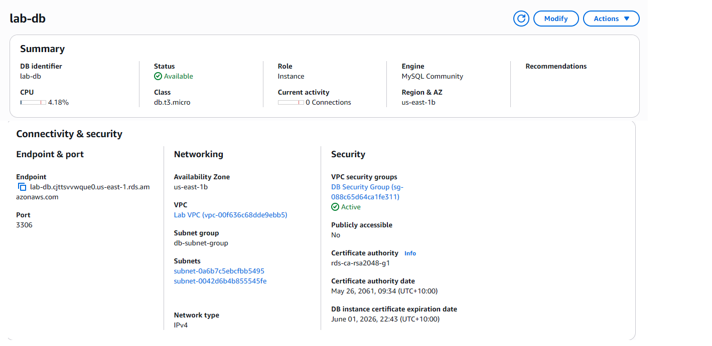
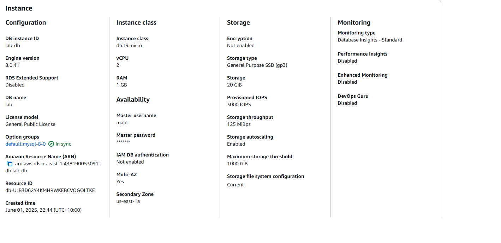
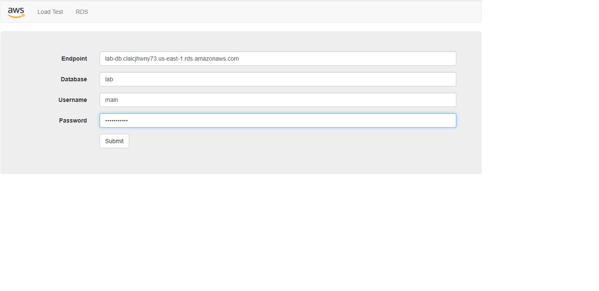
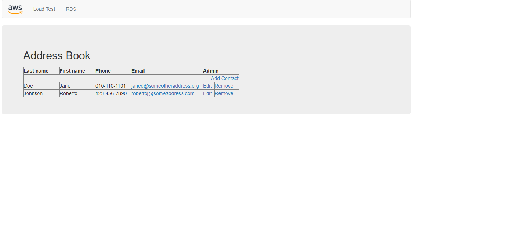

# AWS RDS Database Lab

## Overview
This project demonstrates the setup and configuration of an Amazon Relational Database Service (RDS) instance and its integration with a web-based Address Book application.

The project showcases foundational cloud concepts including database provisioning, networking configuration, and application connectivity.

---

## Technologies Used
- Amazon RDS (MySQL)
- AWS VPC (Virtual Private Cloud)
- Subnets and Security Groups
- Web-based Address Book Application

---

## Project Steps

### 1. Network Configuration
- Configured subnets for database deployment
- Ensured proper network isolation

### 2. Security Configuration
- Created security groups to control database access
- Allowed inbound traffic for application connectivity

### 3. RDS Instance Creation
- Launched a MySQL RDS instance
- Configured compute, storage, and credentials

### 4. Database Configuration
- Retrieved database endpoint
- Configured application connection settings

### 5. Application Integration
- Connected the Address Book application to the RDS database
- Verified successful data storage and retrieval

---

## Outcome

Successfully deployed and connected a MySQL database using Amazon RDS, demonstrating practical understanding of cloud database deployment and networking concepts.

---

## Skills Demonstrated

- Amazon RDS configuration  
- Private subnet database deployment  
- Security group configuration for database access  
- Database connectivity validation  
- Cloud database fundamentals  

---

## Screenshots

### Subnet Configuration

### Security Group Configuration

### RDS Instance Creation

### RDS Instance Details

### Database Connection

### Final Web Application

